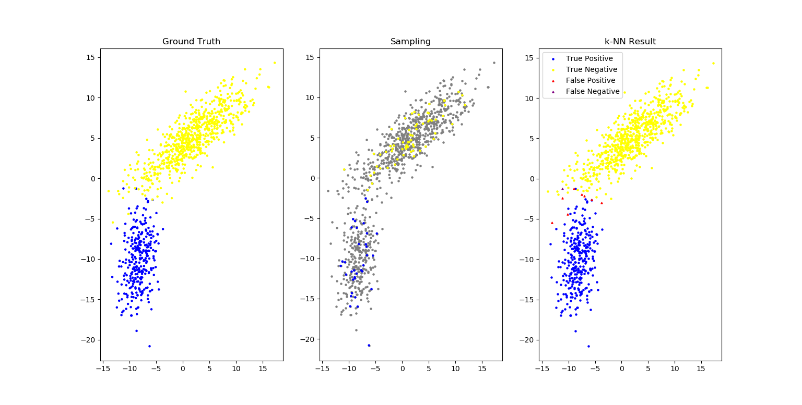
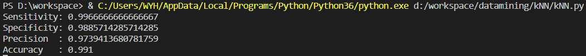
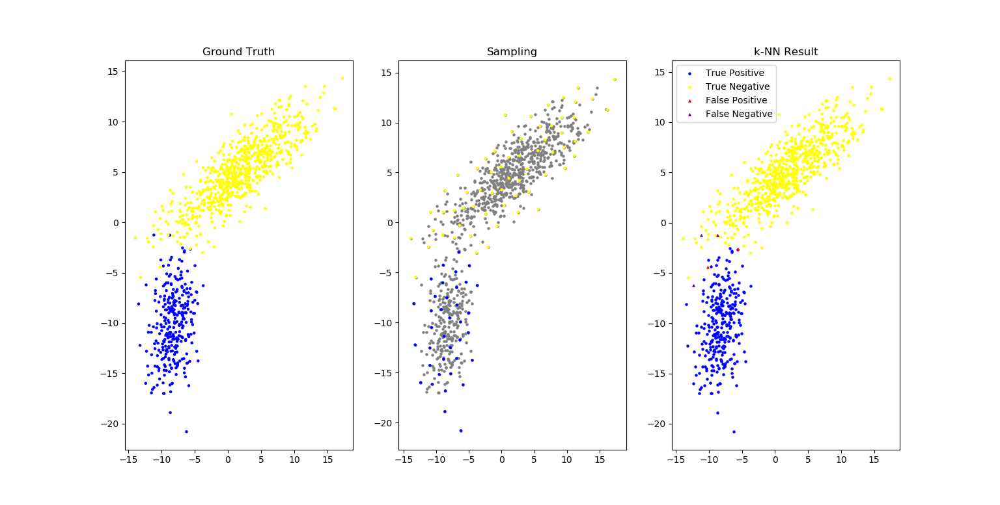
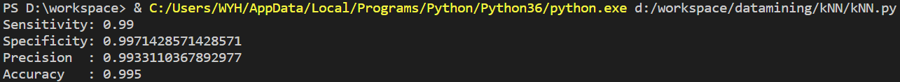

# k-NN (homework)

## Environment

* python 3.6.4
* numpy 1.16.2
* matplotlib 3.0.3

## k-NN algorithm

k-NN 分类算法.
对应 [kNN.py](kNN.py) 中的

```python
def kNN_classify(k, sample_matrix, sample_labels, data_matrix):
```

## Sampling and result

### How to change sampling method

修改 [kNN.py](kNN.py) 中下面这行代码 (line:69) 中的采样方法即可.

```python
# Sampling (10% as sample data set)
sample_matrix, sample_labels = sampling.huang_sampling(data_matrix, data_labels, len(data_matrix) // 10)
```

### Random sampling

简单随机采样.
对应 [sampling.py](sampling.py) 中的

```python
def random_sampling(matrix, labels, num):
```

其结果如下图所示:

四种评价指标 (Sensitivity, Specificity, Precision, Accuracy) 如下:


### Mr.Huang's sampling (bonus)

老师上课讲的采样方法, 可以获得分布均匀的样本.
对应 [sampling.py](sampling.py) 中的

``` python
def huang_sampling(matrix, labels, num):
```

其结果如下图所示:

四种评价指标 (Sensitivity, Specificity, Precision, Accuracy) 如下:
